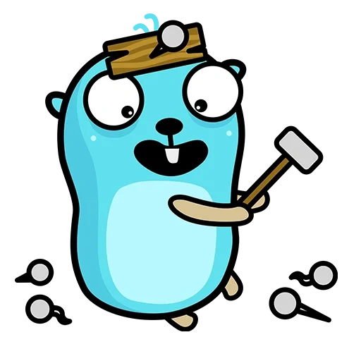

# CRUD API Server

## Task description

Task description is in [backend-job-task.md](./docs/backend-job-task.md)

## Solution notes

- :trophy: Fiber famework for the server with built-in logger
- :package: Bun ORM for repository
- :rocket: caching frequent calls with Redis
- :recycle: clean architecture (handler->service->repository)
- :book: standard Go project layout
- :hammer: Docker-compose, Dockerfile & Makefile included
- :ambulance: Swagger included
- :test_tube: tests with mocks included (over 80% coverage)
- :rotating_light: Linter coverage
- :safety_vest: Github Actions with coverage check

## HOWTO
Create config file in the root directory. Full list of environment variables is here [docs.md](./docs/docs.md), but you can use config from example:
```bash
cp app.yaml.example app.yaml
```
Start the database and cache server, this project includes PostgreSQL and Redis in docker containers.
```bash
make up
```
You are ready to test the server!
```bash
make start
```
If you want to seed database with mock data, you can make specific request or use a following command:
```bash
make fake
```
To stop the containers:
```bash
make down
```

## Proof of work


