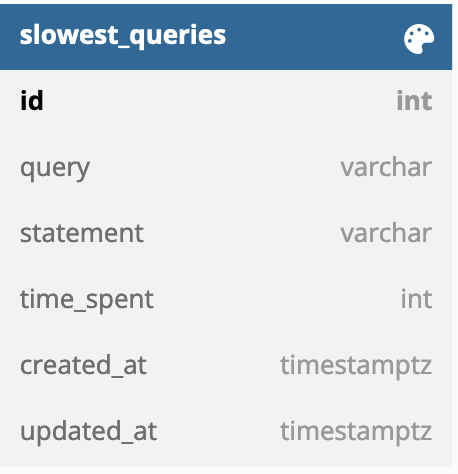

## API Documentation
Documentation can be found [here](http://localhost:3000/swagger/index.html)

## Schema
The Database Schema is quite simple
 

## Config File
The app supports a config file in YAML format.
The name of this file is `app.yaml`, the location is the `root directory`.

## Environment Variables
| Name                                  | Default                                       | Description                                                             |
|---------------------------------------|-----------------------------------------------|-------------------------------------------------------------------------|
| APP_NAME                       | `crud-api`                                   | Name of the application                                    |
| API_ADDRESS                           | `:3000`                                       | Starts application server with a given address
| IDLE_TIMEOUT                         | `1`                                           | Number of minutes of idle timeout      |
| READ_TIMEOUT                         | `1`                                           | Number of minutes of read timeout      |
| WRITE_TIMEOUT                         | `1`                                           | Number of minutes of write timeout      |
| PG_HOST                            | `localhost`                                | Host of the Postgres Database                                                              |
| PG_PORT                         | `5432`                        | Port of the Postgres Database|
| PG_NAME                            | `crud`                                | Name of the Postgres Database                                                              |
| PG_USER                         | `postgres`                        | Username for the Postgres Database|
| PG_PASSWORD                            | `postgres`                                | Password for the Postgres Database|
| REDIS_HOST                            | `localhost`                                | Host of the Redis                                                              |
| REDIS_PORT                         | `6379`                        | Port of the Redis|
| REDIS_DB                            | `0`                                | Redis database number |
| CACHE_TIMEOUT                 | `100`                                           | Cache timeout in milliseconds
| CACHE_EXPIRATION              | `25`                                          | Cache expiration time in seconds |
